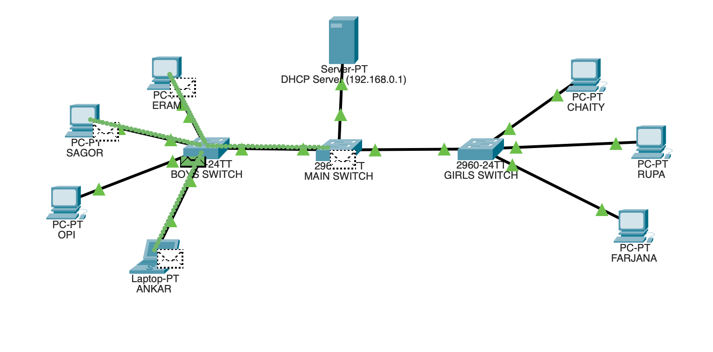
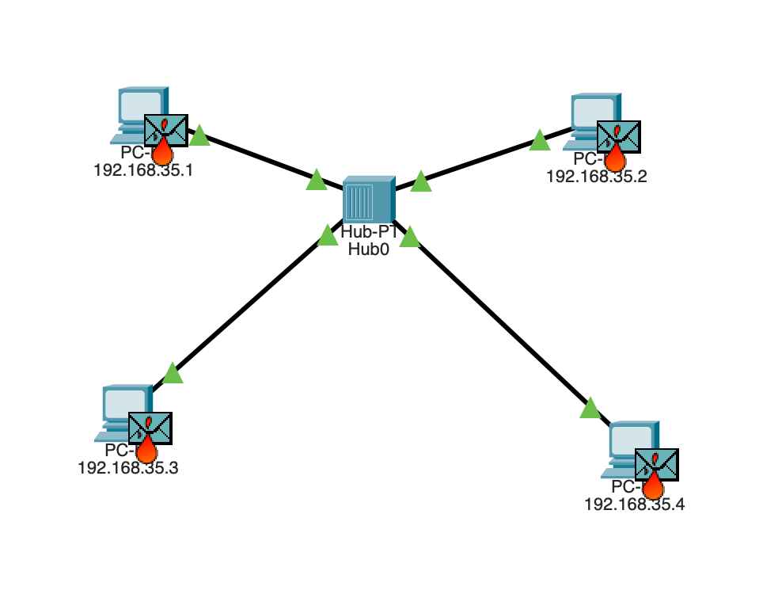

# Cisco-Packet-Tracer
This repository contains various network models and designs to learn Cisco Packet Tracer. This is also a part of my Computer Network Course.

<div align="center">
 
 
</div>

## VLAN Setup on Switch

To add a device (connected with FastEthernet Port 0/1) to VLAN 101, simply write :

```
enable
configure terminal

interface fastEthernet 0/1

switch port mode access
switchport access vlan 101

no shutdown
exit

```

To add another device (connected with FastEthernet Port 0/4) to VLAN 101, simply write :

```
interface fastEthernet 0/4

switch port mode access
switchport access vlan 101

no shutdown
exit

```


After separting devices to different VLANs, save data permanently to non-volatile memory with this command:
```
do write memory
```


 © Akif Islam
